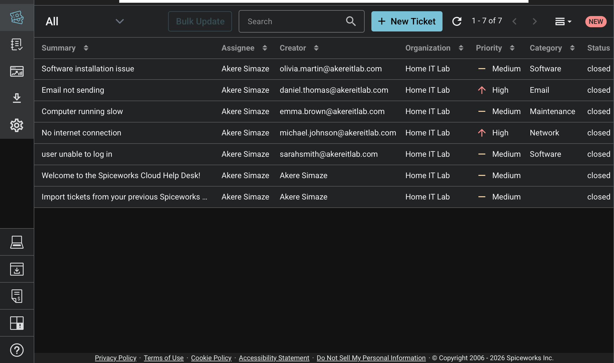
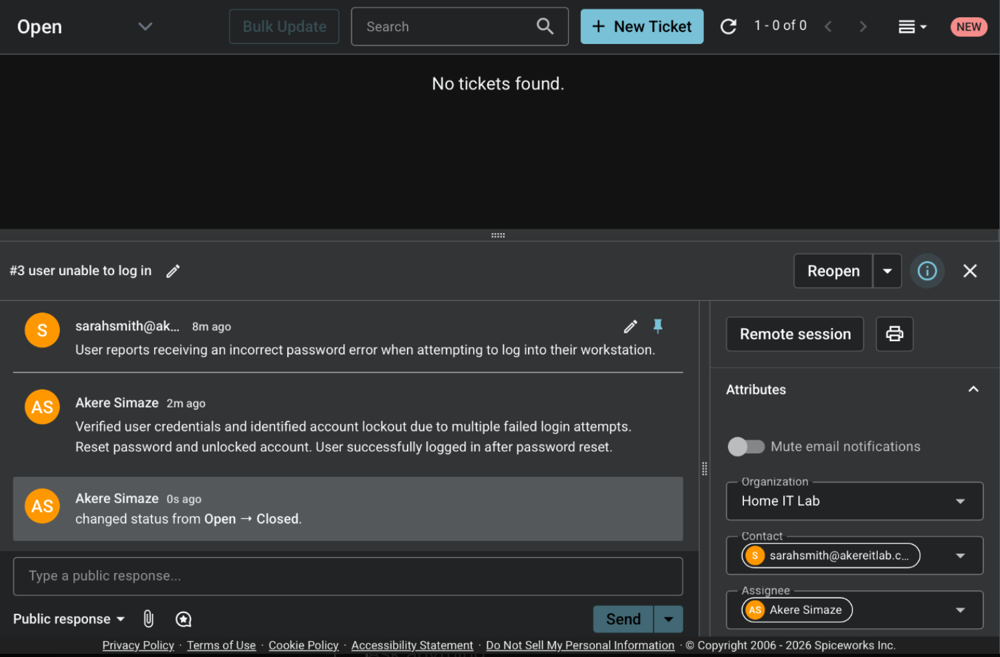
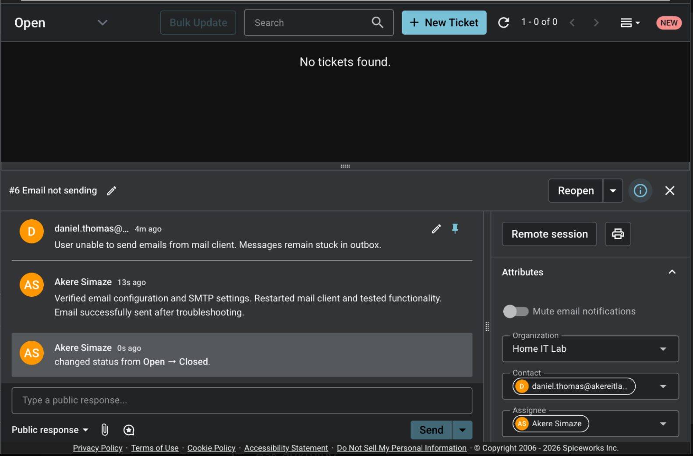

# IT Help Desk Ticketing System Lab

## Overview
This project simulates a real-world IT help desk environment using Spiceworks. It demonstrates the process of managing support tickets, troubleshooting common IT issues, and documenting resolutions in a structured workflow.

## Tools Used
- Spiceworks Help Desk  
- Basic IT troubleshooting concepts  

## Tickets Handled

### User Unable to Log In
- Diagnosed account lockout due to multiple failed login attempts  
- Reset password and restored account access  

### No Internet Connection
- Troubleshot network connectivity issues  
- Restarted network adapter and restored internet access  

### Computer Running Slow
- Identified high CPU usage from background processes  
- Optimized system performance and improved speed  

### Email Not Sending
- Verified email configuration and SMTP settings  
- Restarted mail client and resolved the issue  

### Software Installation Issue
- Identified insufficient user permissions  
- Granted appropriate access and completed installation  

## Screenshots

### Ticket Dashboard

### Account Access Issue

### Email Issue

## Skills Demonstrated
- IT troubleshooting  
- Ticketing system workflow  
- Incident documentation  
- User support and issue resolution  
- Basic networking and system diagnostics  

## Notes
This project is a simulated lab environment designed to demonstrate practical, IT support skills.
